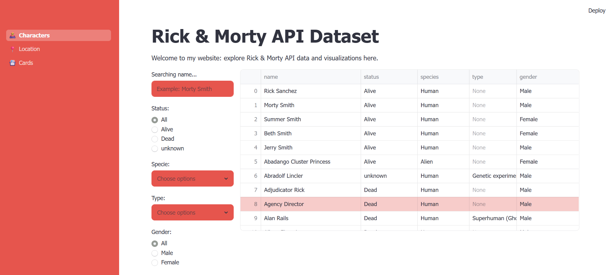
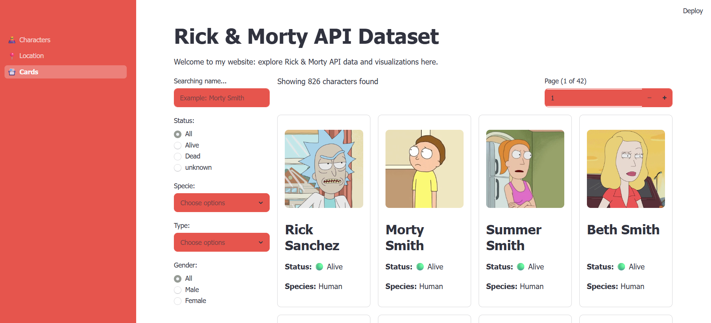
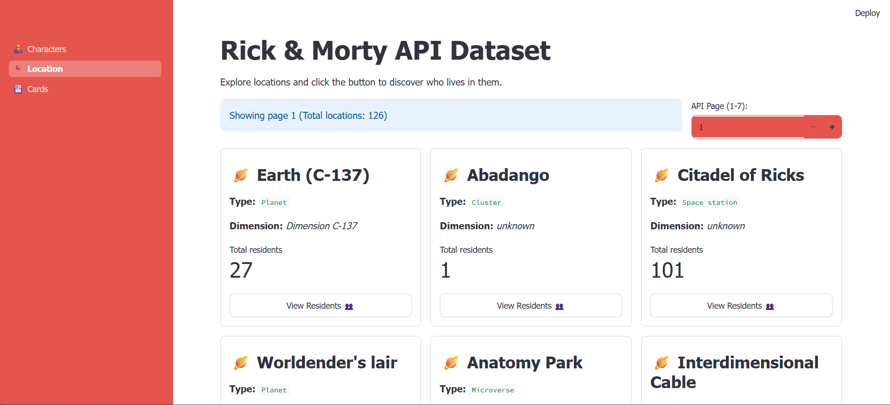

# Rick and Morty Data Project

## Overview

This project contains a structured dataset and analysis resources for the Rick and Morty universe. It is designed for data exploration, cleaning, transformation, and visualization in a data science or analytics context.

## Repository Structure

- `README.md` - Project documentation and instructions.
- `data/` - Folder containing the Rick and Morty dataset file.

## Dataset Files

The `data/` folder should include the following files if available:

- `dataset.csv` - Character-level data including name, status, species, gender, origin.

## Dataset Description

The dataset contains information about Rick and Morty characters, locations, and relationships between them.
Common fields include:

- Character name
- Status (Alive, Dead, Unknown)
- Species
- Gender
- Origin and current location
- Location type, dimension, and resident references

## Relevant Information

- Source: Data may be derived from the Rick and Morty API, official series data, or bootcamp-provided CSV exports.
	- API used: Rick and Morty API (https://rickandmortyapi.com/) — used to fetch character and location data when available.
- Format: Standard CSV files with headers and UTF-8 encoding.
- Cleanup: Expect some missing values, inconsistent labels, and duplicate entries that should be cleaned before analysis.

## Analysis Goals

This repository supports tasks such as:

- Character demographics and status distribution
- Species and gender composition
- Location distribution and origin analysis
- Data cleaning, transformation, and feature engineering

## Usage

1. Open the repository in your code editor or notebook environment.
2. Confirm the dataset files exist in the `data/` directory.
3. Load the CSV files using your preferred tool (Python pandas, R tidyverse, etc.).
4. Inspect columns, sample rows, and missing values.
5. Perform exploratory data analysis, visualizations, and reporting.

Example Python load:

```python
import pandas as pd
characters = pd.read_csv('data/dataset.csv')
```

## Requirements

- Python 3.8+ or R 4.0+
- pandas, matplotlib, seaborn, or equivalent analysis libraries
- Jupyter Notebook / JupyterLab or preferred IDE

## Notes

- Update file paths if the project is moved or if the dataset is stored in a different folder.
- If you add processed outputs or visualizations, place them in a dedicated `output/` or `results/` folder.



